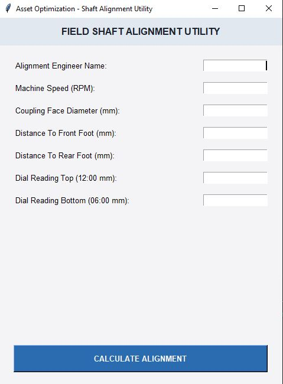
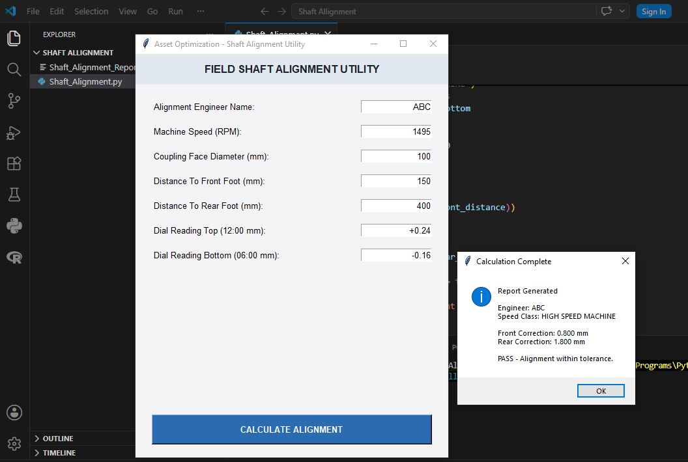
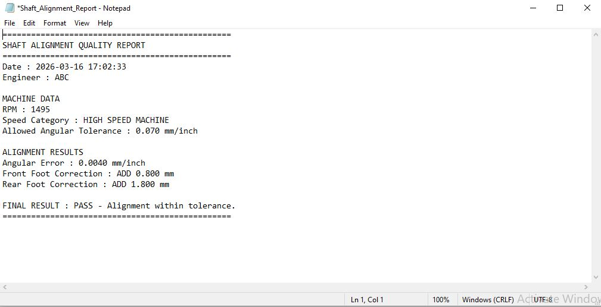

# Shaft Alignment Tool

An open-source Python application for industrial shaft alignment calculations and maintenance reporting.
## Project History

This application was originally developed in **May 2025** as an internal engineering utility for **Global Enterprises**. The software was created to automate shaft alignment calculations, standardize engineering workflows, and generate maintenance reports for rotating equipment commissioning.

Following internal use and with the organization's approval, the project was later refactored into a modular open-source codebase and published on GitHub to demonstrate the engineering methodology and software architecture.

## Download Windows Application

The latest Windows executable is available here:

[Download Shaft Alignment Tool v1.0.0](https://github.com/ArsalanGul7/Shaft-alignment-tool/releases/tag/v1.0.0)

### Windows Users
1. Download:
Shaft Alignment Tool.exe
2. Double-click the application.
3. No Python installation is required.

---

## Overview

A Python-based engineering application for shaft alignment analysis using dial indicator measurements.

The software calculates:

- Vertical TIR (Total Indicator Reading)
- Angular alignment error
- Front foot correction
- Rear foot correction
- RPM-based tolerance evaluation
- PASS / FAIL alignment status

---

## Features

- Engineer identification
- Graphical user interface
- Input validation
- Automatic engineering calculations
- Automatic alignment report generation
- RPM-based tolerance selection

---

## Operating Range

Supported machine speed:

```
400 RPM - 1500 RPM
```

---

## RPM Tolerance Classification

| RPM Range | Category | Tolerance |
|---|---|---|
| 400 - 900 RPM | Low Speed | 0.15 mm/inch |
| 901 - 1200 RPM | Medium Speed | 0.10 mm/inch |
| 1201 - 1500 RPM | High Speed | 0.07 mm/inch |

---

# Application Screenshots

## Tkinter Desktop Interface




## Functional Simulation




## Output Report Phase



---

## Project Structure

```
Shaft-alignment-tool
│
├── src
│   ├── main.py
│   ├── gui.py
│   ├── calculations.py
│   ├── validation.py
│   ├── report.py
│   └── constants.py
│
├── assets
├── docs
├── reports
├── screenshots
└── sample_data
```

---

## Technology

- Python 3
- Tkinter GUI
- Git/GitHub

---

## Running the Application

Clone the repository:

```bash
git clone https://github.com/ArsalanGul7/Shaft-alignment-tool.git
```

Navigate to the project folder:

```bash
cd Shaft-alignment-tool
```

Run the application:

```bash
python src/main.py
```

---

## Generated Reports

Alignment reports are automatically created in:

```
reports/
```

---

## Future Improvements

Planned features:

- Horizontal shaft alignment calculations
- Soft foot detection
- Thermal growth compensation
- PDF engineering reports
- Excel report export
- Windows executable packaging

---

## Author

Syed Arsalan Gul

---

## License

MIT License
